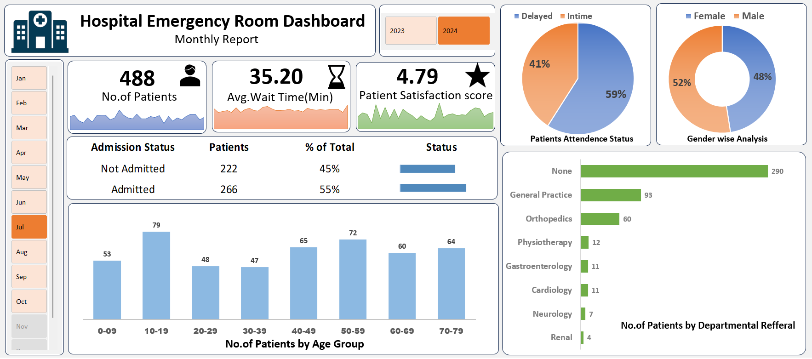

#  Hospital Emergency Room Dashboard – Excel Project

Excel Dashboard analyzing Hospital ER Data

##  Project Overview
This project analyzes 9,216 emergency room patient records to generate operational insights into hospital performance.

The dashboard enables management to monitor patient inflow, waiting time efficiency, satisfaction levels, and departmental workload using interactive Excel visualizations.

---

##  Business Problem
Hospital emergency rooms manage high daily patient volumes. However, the absence of centralized performance tracking led to reactive decision-making.

### Key Challenges:
- Limited visibility into patient inflow trends
- High variability in waiting times
- No structured department-wise workload analysis
- Difficulty tracking admission rates
- Lack of patient satisfaction monitoring system

This project addresses these challenges through structured data analysis and dashboard reporting.

---

##  Tools & Technologies Used
- Microsoft Excel
- Power Query (Data Cleaning & Transformation)
- Pivot Tables
- Pivot Charts
- Data Modeling (Date Table Integration)
- Slicers & Interactive Filters
- KPI Development

---

##  Data Preparation Process

### 1️⃣ Data Cleaning (Power Query)
- Promoted headers
- Split and merged columns
- Removed unnecessary fields
- Standardized inconsistent values (e.g., corrected gender entries)
- Converted appropriate data types
- Validated data integrity (100% valid records)

### 2️⃣ Data Modeling
- Created a Date Table (731 days)
- Linked main dataset with calendar structure
- Enabled time-based filtering (Monthly & Year-wise analysis)

### 3️⃣ KPI Development
- Total Patients
- Average Wait Time (Minutes)
- Patient Satisfaction Score
- Admission Rate
- Attendance Status (Delayed vs On-Time)

---

##  Dashboard Highlights

###  Key KPIs
- Total Patients
- Average Wait Time
- Average Satisfaction Score
- Admission Rate

###  Insights Generated
- patients attended on time
- experienced delays
- Highest department Refferal
- Gender distribution
- Peak patient groups

---

##  Business Impact
This dashboard enables hospital management to:

- Reduce patient waiting time
- Optimize staff allocation
- Identify overloaded departments
- Improve patient satisfaction
- Monitor monthly operational performance

The solution converts raw emergency room data into actionable, data-driven insights.

---

##  Dashboard Preview

---

##  Dashboard Demo
[Click here to watch the dashboard demo](dashboard.mp4)

---

##  Project Outcome
Successfully developed an end-to-end Excel-based analytics solution integrating data cleaning, modeling, KPI tracking, and interactive dashboard design.

