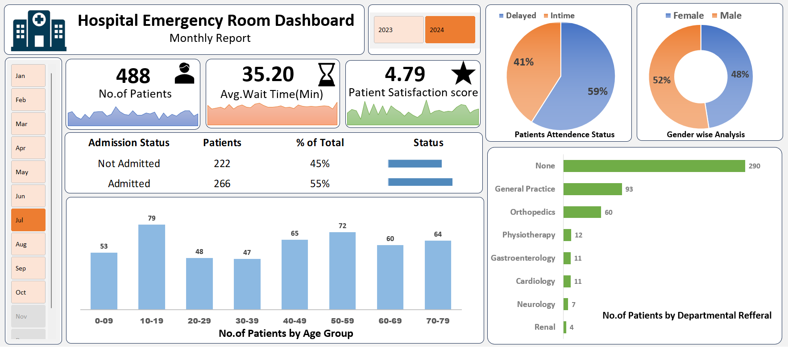

#  Hospital Emergency Room Dashboard | Microsoft Excel

## Project Overview

The Hospital Emergency Room Dashboard is an interactive Microsoft Excel dashboard developed to analyze patient flow, waiting time, patient satisfaction, admission status, and departmental referrals. The project combines Power Query for data preparation, Power Pivot for data modeling, and Excel dashboards to transform raw hospital data into meaningful operational insights.

The dashboard enables hospital administrators to monitor emergency room performance, identify patient trends, and support operational decision-making through interactive reporting.

---

## Business Problem

Hospital Emergency Rooms handle thousands of patients throughout the year, making it difficult to manually track patient volume, waiting times, admissions, referrals, and service quality.

The objective of this project was to build an interactive reporting solution that provides hospital management with a centralized view of emergency room operations, helping them monitor performance and identify opportunities to improve patient care.

---

## Dataset

- **Industry:** Healthcare
- **Domain:** Hospital Emergency Room
- **File Format:** CSV
- **Analysis Period:** 2023 – 2024

### Key Fields

- Patient ID
- Patient Age
- Gender
- Visit Date
- Wait Time
- Admission Status
- Patient Satisfaction Score
- Department Referral
- Attendance Status

---

## Tools & Technologies

- Microsoft Excel
- Power Query
- Power Pivot
- Pivot Tables
- Pivot Charts
- Slicers
- Data Modeling
- KPI Development

---

## Data Preparation

The dataset was prepared before building the dashboard to ensure consistency and reliability.

The preparation process included:

- Removing unnecessary columns
- Renaming columns
- Correcting data types
- Cleaning inconsistent text values
- Standardizing categorical values
- Handling missing values
- Creating a dedicated calendar table for time-based analysis

---

## Power Query Transformation

Power Query was used to automate data cleaning and transformation.

Major transformations performed include:

- Promoted Headers
- Split Columns
- Merged Columns
- Trimmed Text
- Cleaned Text
- Changed Data Types
- Renamed Columns
- Replaced Inconsistent Values
- Created Date Table
- Prepared the dataset for Power Pivot

---

## Data Model

A simple data model was created using Power Pivot.

Relationships were established between:

- Hospital Emergency Room Data
- Date Table

This enabled accurate time-based filtering and yearly comparisons.

---

## Dashboard Overview

The dashboard provides an interactive overview of emergency room operations through KPI cards, charts, and slicers. Users can analyze patient volume, waiting time, satisfaction scores, admissions, referrals, attendance status, and demographic distribution across different months and years.

Interactive filters allow users to compare performance between 2023 and 2024 while exploring monthly trends.



---

## Key Performance Indicators (KPIs)

The dashboard tracks the following business metrics:

- Total Number of Patients
- Average Waiting Time
- Patient Satisfaction Score
- Admission Rate
- Attendance Status
- Gender Distribution

---

## Dashboard Features

- Interactive Month Slicer
- Year Comparison
- KPI Cards
- Patient Age Group Analysis
- Admission Status Analysis
- Attendance Status Analysis
- Department Referral Analysis
- Gender Analysis
- Interactive Filtering
- Monthly Performance Monitoring

---

## Key Insights

The dashboard helps stakeholders understand:

- Monthly patient volume trends.
- Average waiting time across reporting periods.
- Patient satisfaction performance.
- Admission versus non-admission distribution.
- Patient attendance status.
- Gender distribution of patients.
- Age group distribution.
- Departments receiving the highest referrals.

---

## Business Recommendations

Based on the analysis:

- Monitor waiting time regularly to improve patient experience.
- Allocate additional resources during high patient volume periods.
- Review departments with the highest referral rates to improve operational efficiency.
- Continue monitoring patient satisfaction to identify service improvement opportunities.
- Use monthly performance trends for workforce and resource planning.

---

## Business Impact

This dashboard provides hospital management with a centralized reporting solution that simplifies emergency room performance monitoring. By combining operational KPIs with interactive analysis, it supports faster decision-making, improves visibility into patient flow, and helps identify areas for service improvement.

---

## Skills Demonstrated

This project demonstrates practical experience in:

- Data Cleaning
- Data Transformation
- Power Query
- Power Pivot
- Data Modeling
- KPI Development
- Dashboard Design
- Interactive Reporting
- Data Visualization
- Business Analysis
- Microsoft Excel

---

## Project Structure

```text
Hospital-Emergency-Room-Dashboard/

│── README.md
│── Images/
      Dashboard preview.png
│── Video/
      Dashboard.mp4
│── Dashboard/
      Hospital ER Dashboard.xlsx

│── Dataset/
      Hospital ER Dataset.csv

```

---

## How to Use

1. Download the project files.
2. Open the Excel workbook.
3. Refresh Power Query if required.
4. Navigate to the Dashboard worksheet.
5. Use the Month and Year slicers to explore different reporting periods.
6. Analyze KPIs and charts to evaluate emergency room performance.

---

## About This Project

This project was developed to strengthen my Microsoft Excel data analytics skills by applying Power Query, Power Pivot, and dashboard development techniques to a healthcare dataset. The project demonstrates how Excel can be used to prepare data, build analytical models, and create interactive business reports.

---

## Author

**Mohan Thurpati**

Aspiring Data Analyst

**Skills:** Excel • SQL • Power BI • Python

**LinkedIn:** https://www.linkedin.com/in/mohanthurpati

**Portfolio:** https://mohanthurpati.framer.website
---


